<h2 p align="center" > Criando VMs, utilizando conexão SSH e copias entre redes atráves do SCP </h2>

<i> 
 Para este exemplo utilizarei a Virtual Box da Oracle.

## Passo 1 - Baixando a ISO
        - Para o nosso exemplo utilizarei a ISO CentOS 7.9.2009-Minimal
        - http://mirror.ufscar.br/centos/7.9.2009/isos/x86_64/CentOS-7-x86_64-Minimal-2009.iso 

        
## Passo 2 - Criando e configurando uma VM

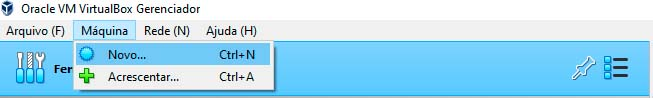

        - Selecione a opção seguinte pelo mouse ou pelo atalho Ctrl+N

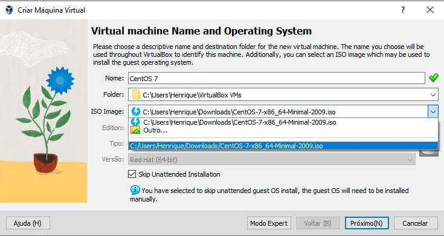
        
        - Escreva o nome da sua ISO da forma que preferir e selecione a imagem da mesma, buscando-a no diretório que ela foi baixada, no meu caso C:/Users/Henrique/Downloads/CentOS-7-x86_64-Minimal-2009.iso

        - Marque a caixa Skip Unattened Installation para pular configurações mais detalhadas da instalação

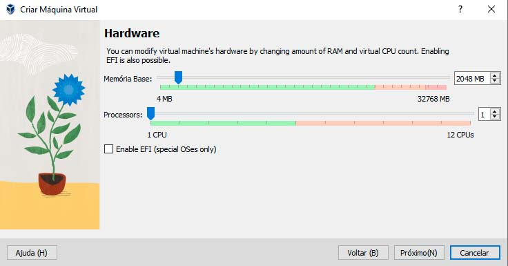

        - Selecione o hardware da sua VM conforme a capacidade da sua maquina

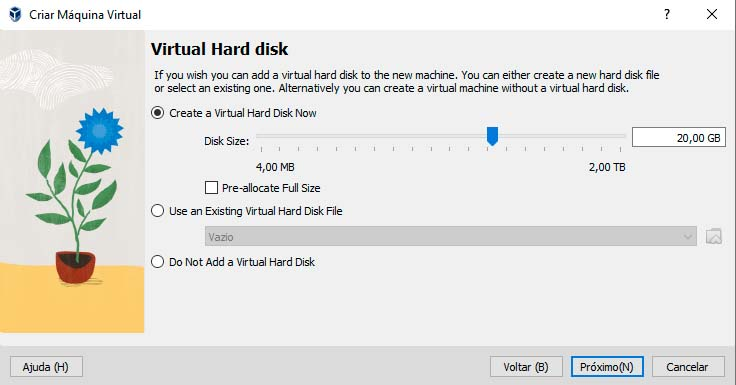

        - Faça o mesmo com o armazenamento, não precisamos mais do que alguns GBs de espaço

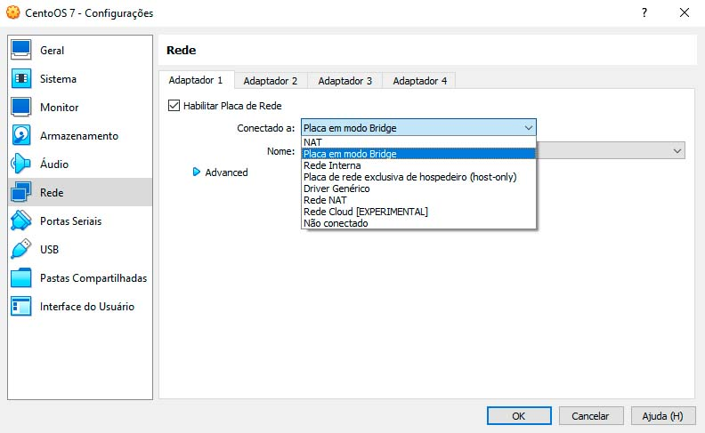

        - Após finalizar a configuração primaria voltaremos a tela inicial da VM, clica no icone da engrenagem ou utilize o atalho Ctrl+S. Selecionaremos na aba de Rede a opção Placa em modo Brige.

        - Caso exista dúvida sobre os tipos de conectores vou deixar uma breve explicação sobre as conexões mais comuns das VMs.

        Somente host : a VM receberá um IP, mas só estará acessível na caixa em que a VM está sendo executada. Nenhum outro computador pode acessá-lo.

        NAT : assim como a sua rede doméstica com um roteador sem fio, a VM será atribuída em uma sub-rede separada, como 192.168.6.1 é seu computador host e a VM é 192.168.6.3 , sua VM pode acessar a rede externa como seu host, mas sem acesso externo à sua VM diretamente, ela está protegida.

        Bridged : sua VM estará na mesma rede que seu host, se seu IP de host for 172.16.120.45 , sua VM será como 172.16.120.50 . Ele pode ser acessado por todos os computadores na sua rede host.

## Passo 3 - Inicializando a VM

        - Aqui começaremos a utilizar a nossa VM recém criada, mas antes precisamos configurar mais alguns detalhes

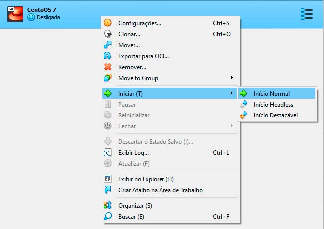

        - Inicie a sua VM em modo normal para ter acesso a CLI.

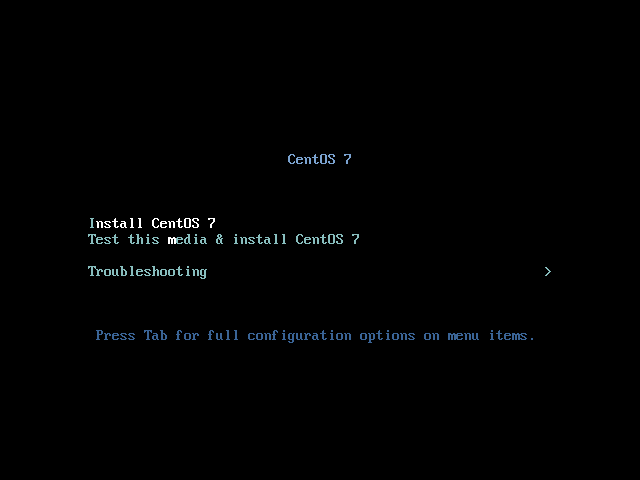

        - Escolhemos uma ISO sem interface gráfica
        - Selecione a opção de instalação da ISO atráves do teclado
        - Após uns instantes (dependendo da sua maquina) a instalação te levara a tela de seleção de idioma, selecione o idioma desejado e avance a instalação

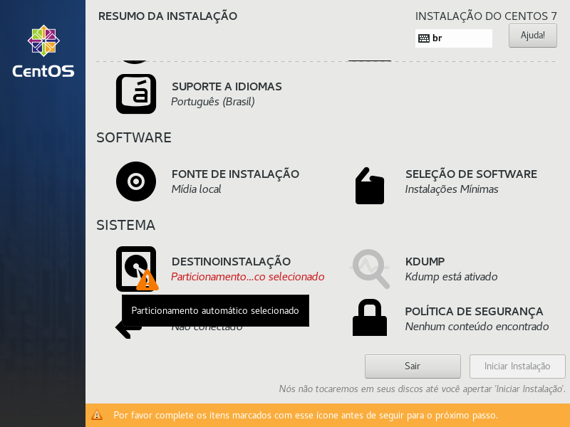

        - Selecione a partição criada anteriormente

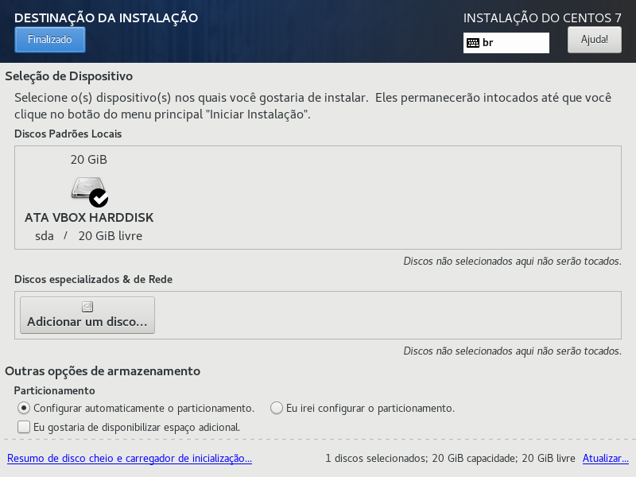

        - Clique no botão finalizado no canto superior esquerdo após selecionar o disco

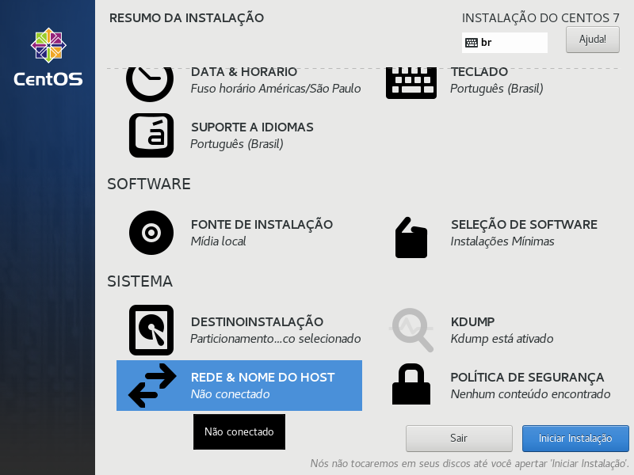

        - Clique na opção de Rede & Nome do Host

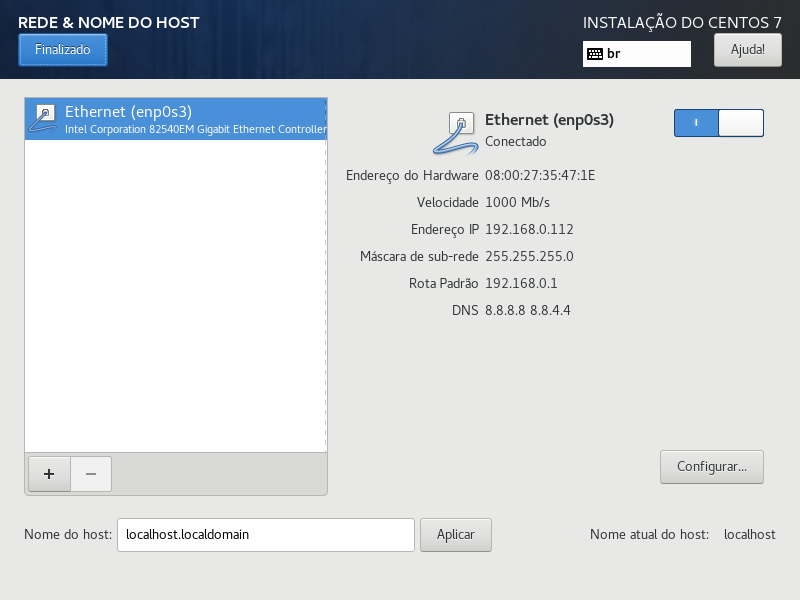

        - Clique no interruptor para ativar sua conexão, recebendo as configurações de rede, como ip, mask e dns padrão.
        - Caso pulasse esta etapa teria de ser configurado manualmente no sistema atráves do comando "nmtui" (confira o comando caso se sinta curioso)

        - Estamos quase lá, caso deseje crie um usuario e depois atribua suas permissões no /etc/sudoers
        - Finalizado as configurações desligue sua VM pois iremos clona-la para utilizarmos uma conexão SSH

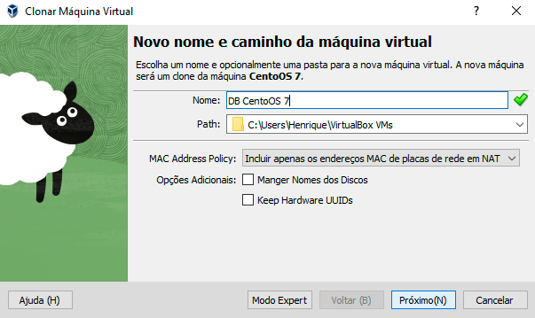

        - Clique com o botão direito no icone da ISO criado ou utilize o atalho Ctrl + O para o mesmo destino
        - Utilize o nome que desejar, neste exemplo utilizaremos DB CentOS 7
        - Clique no botão próximo e selecione a opção soft link, para clonar uma ISO em cima do espaço de armazenamento da nossa ISO original evitando a necessidade de se criar outro disco de armazenamento

## Passo 4 - Conexão SSH entre VMs

        - Ligue ambas as VMs em modo normal 
        - Faça login com as credencias que você criou

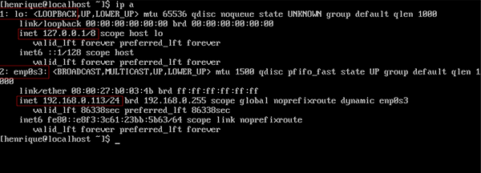

        - Utilize o comando ip a ou ip addr para identificar o ip setado para a VM
        - Note os retangulos em vermelho, o primeiro campo identificado pelo numero 1: seguido de lo: com o ip 127.0.0.1/8 que é o ip de loopback
        - Abaixo temos a nossa placa de rede identificada como 2: enp0s3 com o ip abaixo de 192.168.0.113/24 que é o ip da nossa VM por onde poderemos fazer a conexão SSH.

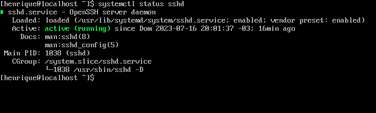

        - Verifique se o servidor SSHD esta ativo atráves do comando systemctl status sshd ou service sshd status. Caso na sua VM o serviço não esteja ativo, ative-o atráves do systemctl start sshd.
        - Caso queira deixar o serviço ativo após o reboot set a opção: systemctl enable sshd.

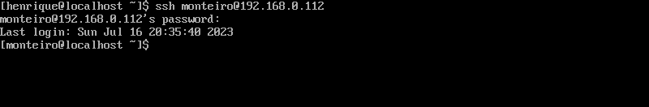

        - Para acessar a outra VM antes devemos saber o ip dela utilizando o comando ip a ou ip addr show, neste caso o ip é 192.168.0.112.
        - Para fazer a conexão SSH basta utilizar o comando ssh, seguido do usuario da vm que quer acessar separando o ip do nome pelo caracter "@". 
        - Desta forma o acesso a outra VM ficou sendo ssh monteiro@192.168.0.112. Aperte enter e o terminal pedira a senha, após efetuar o login você estara dentro da outra VM

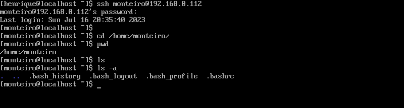

        - Podemos ver que na VM que estamos logados não existe arquivo nenhum na home do usuario monteiro.
        - Cheque o diretorio home com o comando ls /home/"usuario"/
        
## Passo 5 - Copia de arquivos entre VMs atráves do SCP

        - Agora utilizaremos o comando SCP que deriva da junção do SSH + COPY, semelhante ao cp mas que faz a copia atráves da conexão SSH

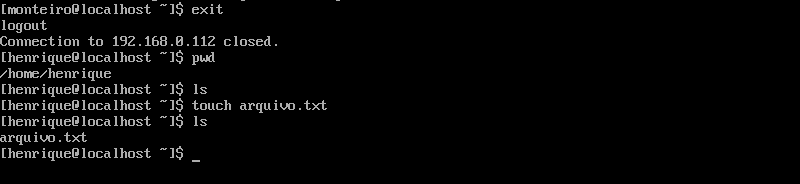

        - Vamos sair desta VM com o comando exit. Após o logout vamos criar um arquivo de texto vazio com o comando touch na nossa home. 
        - Agora atráves do comando SCP vamos fazer a copia deste arquivo para a nossa outra VM.

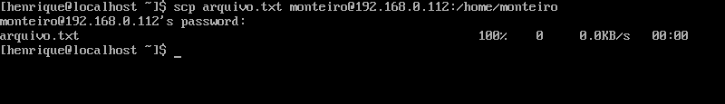
     
        - Semelhante ao comando cp, nós estamos copiando o arquivo texto do diretório atual que estamos sem precisar passar o caminho absoluto que seria /home/henrique/arquivo.txt
        - Utilizando o comando scp arquivo.txt monteiro@192.168.0.112:/home/monteiro nós estamos fazendo o seguinte:
        
        - Primeiro copiamos o arquivo do diretorio atual, depois passamos a conexão ssh que desejamos, neste caso monteiro@192.168.0.112, utilizamos a sintaxe : logo após ao ultimo digito para concatenar a conexão ssh com o próprio diretório absoluto que neste caso é o /home/monteiro.

        - Desta forma podemos acessar novamente a outra Vm atráves do SSH e ver a copia do arquivo.

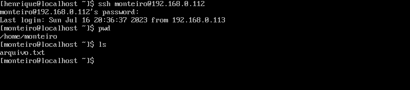

        - Utilizando o pwd para mostrar o diretório que estamos e o comando ls para mostrar o conteudo do mesmo, notamos que o arquivo foi copiado com sucesso.

        

        

    
        
